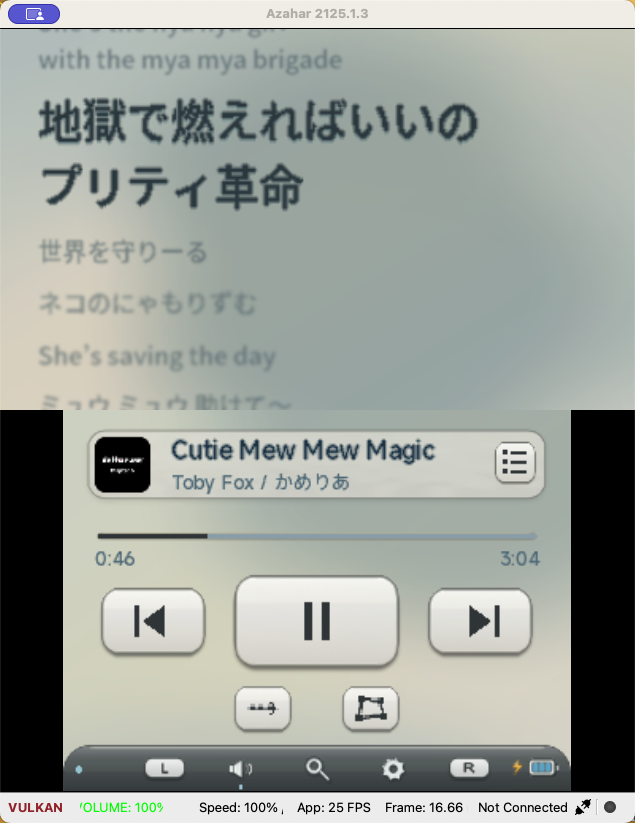
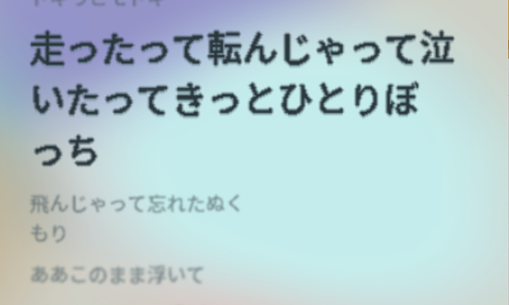
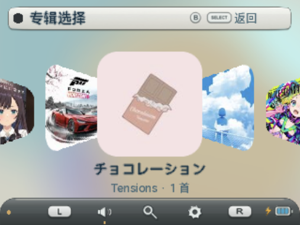
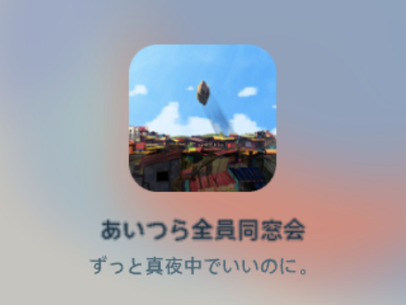
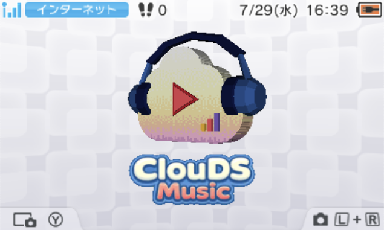

<p align="center">
  
</p>

<h1 align="center">ClouDS Music</h1>

<p align="center">
  <strong>云音乐，重新为 Nintendo 3DS 设计。</strong>
</p>

<p align="center">
  在线播放 · 动态歌词 · 离线缓存 · Cover Flow · 动态 3D Banner
</p>

<p align="center">
  <sub>FA branch · Version 2.0.0 · Nintendo 3DS</sub>
</p>

ClouDS Music FA 是一个原生 Nintendo 3DS 云音乐客户端。它保留了原项目的
在线音乐能力，并从双屏交互、歌词、视觉系统、缓存和 HOME Menu 展示开始，以简洁的
Flat Aero风格完全重做。

> 本项目不是云音乐或 Nintendo 的官方产品。服务依赖非公开接口，未来可能因
> 接口变化而暂时不可用；项目不会绕过 VIP、地区、购买或下架限制。

<!--
HERO SCREENSHOT
将双屏正在播放截图保存为：
docs/screenshots/fa-player-lyrics.png

<p align="center">
  
</p>
-->

FA 分支建立在 [cadl/ClouDS-Music](https://github.com/cadl/ClouDS-Music) 的网络、
解码与服务基础之上。

## 🎵完整的音乐播放器

### 播放

- 云音乐在线播放，支持歌曲、歌单、每日推荐和公开推荐内容
- 顺序播放、单曲循环与随机播放，播放模式和可视化模式自动保存
- 进度拖动、上一曲、下一曲、暂停与继续
- 播放队列基本操作：支持删除确认，以及按住 `Y` 配合上下方向键重新排序

播放器面板同时支持触屏和实体按键。`A` 单击播放或暂停、双击下一曲、三击上一曲，
是对经典 Walkman 操作方式的一点致意；十字键与 Circle Pad 也可以直接控制歌曲。

### 浏览与搜索

- 浏览每日推荐、公开推荐、已创建和已收藏的歌单
- 搜索歌曲、歌手、专辑，以及特色的“声音”内容
- 搜索结果分页加载
- 中文使用项目内置拼音输入；英文与日文可通过触屏调用 3DS 系统键盘
- 云音乐 App 扫码登录；账号状态只以状态灯表示，不在录屏中泄露账号名称

### 缓存与离线

- 分别缓存音频、歌词与封面，已经完整缓存的歌曲可离线播放
- 播放列表与专辑详情显示缓存状态
- 可查看歌曲、歌词、封面三类缓存数量与总占用
- 支持缓存上限、后台整理和清空缓存；清理时保留正在播放的歌曲
- 3DSX 与 CIA 共用 `/3ds/ClouDS-Music` 数据目录

## 💭歌词，不只是字幕

上屏使用一套为 3DS 重新实现的 Apple Music 风格动态歌词系统。

- 当前歌词、候选歌词和离场歌词组成逐行弹簧队列
- 行与行依次启动，带有受控的惯性、回弹和非线性落位
- 距离当前行越远，模糊越强
- 当前歌词强调显示，长句自动换行并动态改变布局
- 换行不会出现把单个字符或孤立标点新开一行的问题
- 中、日、英及常用多语言字符使用统一歌词字体和基线；常见 Unicode 符号可正常显示
- 支持靠左或居中排列，切换和长句重新排版都有连续过渡
- 支持裸眼 3D 视差


<!--
LYRICS SCREENSHOT
将一张包含双行激活歌词、远端模糊和频谱的上屏截图保存为：
docs/screenshots/fa-lyrics-detail.png

<p align="center">
  
</p>
-->

## 🔊声音也会驱动画面

ClouDS Music FA 提供四种可视化状态：

- **波形**：左右声道的真实音频波形
- **频谱**：从实时音频分离频段的 3DS Sound 风格柱状频谱
- **电平**：更简洁的动态电平显示
- **关闭**：隐藏图表，让背景接管节奏

关闭可视化后，播放器会复用频谱分析中的低频能量驱动背景。低音到来时，彩色云层在约 150 ms 内扩张，随后缓慢熄灭；熄灭期间不会被连续峰值反复点亮。律动强度会结合节拍估计。

背景本身由专辑封面的代表色生成。颜色、形状和上下屏种子彼此独立，云层缓慢流动，
切歌时平滑过渡，并保存上一次播放的背景状态。

## 🖥️为双屏重新设计

视觉语言来自 Nintendo 3DS System Settings 的舒适层次，以及现代 Apple Music 的
留白、动效和内容组织。结果更接近 **Flat Aero**

- 重新绘制全部主要页面
- 米色与浅灰色系统控件、圆润边角、分层高光和统一的按压辉光
- 专辑取色的动态背景与可选控件配色
- 深色模式
- 页面切换、弹窗、列表滚动和状态栏收放使用非线性景深动画
- 所有主要页面支持触控，同时保留完整的按键操作
- 中英文界面

### 沉浸式播放

经过设定时间没有操作后，下屏控件会平滑退场，只留下放大的专辑封面、歌曲名与歌手名。
无论自动沉浸是否开启，都可以按 `Y` 手动进入。任意按键或明显的主机晃动会退出沉浸。

### Cover Flow

点击播放器中的专辑封面即可进入 Cover Flow。播放列表会按专辑自动合并，封面以真正的 3D 透视角度向画面内侧折转，并进行循环队列排列。选择封面后进入专辑详情。

<!--
FEATURE SCREENSHOTS
请分别保存：
docs/screenshots/fa-coverflow.png
docs/screenshots/fa-immersive-dark.png

<p align="center">
  
  
</p>
-->


## 🏴真正的动态 3D Banner

- 主模型会按节奏上下律动并轻微左右摇摆
- HOME Menu 可正常旋转主模型
- Logo 使用独立的 Y 轴 billboard，始终面向相机，不随主体翻转
- 模型、Logo 和材质都经过安全区、光照与反光校正

### 面向 Homebrew 的 Extended Banner 工作流
它继承了
[Super Mario 64 3DS Port Ultimate](https://github.com/Epic0522/Super-Mario-64-3ds-port---Ultimate)
中的（模型内）静态 3D Banner 经验，并补全了动态模型、固定朝向 Logo、材质修正和真机安全动画。

> **模拟器能播放，不等于真实 HOME Menu 能安全播放。**
>
> 软蒙皮骨骼动画在模拟器中可以正常运行，会真机选中应用时直接卡死 HOME
> Menu。经过静态/动态对照以及对官方 Extended Banner 结构的研究，本项目采用普通
> `Transform (5)` CANM 成员驱动刚性 mesh node。骨骼可以用于 Blender 内的动画创作，
> 但 skin、bone index 和 bone weight 不应进入最终 CGFX。

#### Extended Banner 由什么组成

一个可旋转、可播放动画的 CIA Banner 至少包含：

1. 带有 `extendedbanner` 标志的 SMDH；
2. 一个 CGFX/BCRES 3D 场景；
3. 可选的 Banner 音频；
4. 由 `bannertool` 封装的 Banner 容器；
5. 通过 `makerom` 写入 CIA 的 icon、Banner、ExHeader 与程序本体。

`.3dsx` 仍然可以通过 Homebrew Launcher 启动，但 HOME Menu Extended Banner 只会
随 CIA 安装包展示。

```text
Blender / glTF
    ↓
只保留刚性 mesh-node TRS 动画
    ↓
pycgfx：glTF → CGFX
    ↓
补写 billboard、mesh-node 绑定与材质参数
    ↓
banner.cgfx + audio.wav
    ↓
bannertool：生成 .bnr
    ↓
makerom：生成 CIA
```

#### 1. 准备工具

本仓库最后验证使用 Blender 5.1.2，以及
[skyfloogle/pycgfx](https://github.com/skyfloogle/pycgfx) 的
`1f78850086f3a77c41e07162e842f97a5bf3c18a` 提交。其他 Blender 版本也可以工作，
但导入、导出和动画 API 可能需要调整。

```sh
git clone https://github.com/skyfloogle/pycgfx.git .tools/pycgfx
git -C .tools/pycgfx checkout 1f78850086f3a77c41e07162e842f97a5bf3c18a

python3 -m venv .tools/pycgfx/.venv
.tools/pycgfx/.venv/bin/pip install gltflib pillow
```

还需要：

- Blender；
- `bannertool` 与 `makerom`；
- 可以构建目标程序的 devkitARM 环境；
- 模型、Logo、纹理和音频素材。

pycgfx 仓库附带了 HOME Menu 相机参考 glTF，可以在建模阶段用来检查构图。最终
CGFX 应严格控制在 **512 KiB 以下**；本项目的成品约为 331 KiB。

#### 2. 设计场景

HOME Menu 会自动旋转模型，所以需要同时检查正面、侧面和背面。

- 将主体原点放在合理的旋转中心；
- 为 HOME Menu 顶部信息和底部相机提示条留下安全区；
- 不要让 Logo、头部或装饰在旋转时越出屏幕；
- 优先使用简单的 diffuse 材质、较少的材质槽和保守尺寸的纹理；
- 透明 Logo 使用 alpha mask；复杂的半透明混合应先在真机验证；
- 不要依赖桌面 PBR 高光得到主要轮廓，3DS HOME Menu 的结果可能完全不同。

#### 3. 制作硬件安全的动画

推荐让每个需要运动的部分成为独立 mesh node，并只为节点记录：

- translation；
- rotation；
- scale。

这些轨道在 CGFX 中应成为普通 `Transform (5)` CANM 成员。节点名称可以自由决定，
但 glTF animation target、CGFX skeleton bone、SOBJ 的 `mesh_node_name` 和 CANM
成员名称必须相互对应。

如果原始动画使用骨骼或软蒙皮，可以保留它作为**创作 Rig**，再做一次烘焙：

1. 在 Blender 中完成骨骼动画；
2. 选择一帧作为最终网格的基础姿态；
3. 将这一帧的变形应用到完整分辨率网格；
4. 把需要的运动采样为独立 mesh node 的 TRS；
5. 删除 Armature modifier、骨骼父级和 vertex group；
6. 确认导出的 glTF 不再含 `JOINTS_*` 或 `WEIGHTS_*`；
7. 转换后确认所有 primitive set 的 `skinning_mode == 0`。

不要只删除骨架对象：只要顶点流里还残留 bone index/weight，最终文件就仍然不是可靠的刚性动画。

动画时间范围也必须显式设置。Blender 默认的第 250 帧可能被一并导出，结果就是模型动一下后静止数秒。循环动画建议：

- 明确设置 FPS、开始帧和结束帧；
- 首尾姿态一致；
- 如果需要，在循环末尾主动保留少量静止帧；
- 不导出默认时间轴上没有内容的长尾；
- 预览循环时避免重复播放首尾相同的两帧。

#### 4. 添加不会随主体旋转的 Logo

glTF 没有 CGFX billboard 标志，因此 Logo 需要分两步处理：

1. 在 Blender 中建立独立平面，把最终位置、旋转和缩放烘焙进顶点；
2. 转为 CGFX 后，将对应 bone 的 billboard mode 写为 `YAxial (5)`。

本仓库使用的层级是：

```text
COMMON
├── world        # 可旋转的主模型
└── name         # 独立 Logo 平面，CGFX 中设为 YAxial billboard
```

Logo 不应成为 `world` 的子节点，否则会跟随主模型翻转。平面自身应保持 identity
transform，让 billboard 只负责朝向相机；视觉位置已经烘焙到顶点中。

如果 Logo 在 HOME Menu 中变成一条细线，通常是节点仍带着 Blender 的平面旋转，
billboard 又重复应用了一次旋转。如果 Logo 正面镜像或上下颠倒，应修正平面法线与 UV，
不要靠给 billboard 节点再叠加旋转。

#### 5. 使用本仓库脚本作为模板

三个脚本完整保留了这次已在真机跑通的流程：

```text
tools/banner/create_rhythm_animation.py
tools/banner/build_banner_scene.py
tools/banner/convert_banner_cgfx.py
```

它们是**可修改的参考实现**，不是能够识别任意模型结构的一键转换器。移植到其他项目时至少需要替换：

- `MESH_NAMES` / `RIGID_ANIMATED_MESHES`；
- 源 Rig 与动画 bone 名称；
- 模型缩放、垂直位置和安全区；
- Logo 尺寸、深度、节点名与纹理；
- 动画 FPS、开始帧、结束帧和需要保留的 TRS 轨道；
- 材质修正策略。

如果模型本来就是静态场景或已经使用刚性节点动画，可以跳过
`create_rhythm_animation.py`，也不需要执行软蒙皮烘焙；从自己的干净 glTF 场景开始，
只复用 Logo、CGFX 修正与验证步骤即可。

创建或整理动画的示例：

```sh
BLENDER=blender
# macOS 应用程序版本可改为：
# BLENDER=/Applications/Blender.app/Contents/MacOS/Blender

"$BLENDER" --background --factory-startup \
  --python tools/banner/create_rhythm_animation.py -- \
  input-model.gltf output-directory
```

组装主模型和 Logo，并把软蒙皮创作动画转为刚性节点动画：

```sh
"$BLENDER" --background --factory-startup \
  --python tools/banner/build_banner_scene.py -- \
  output-directory/clouds-banner-rhythm.gltf \
  path/to/logo.png \
  banner-scene.gltf
```

将 glTF 转成 CGFX，并写入 glTF 无法表达的属性：

```sh
.tools/pycgfx/.venv/bin/python \
  tools/banner/convert_banner_cgfx.py \
  banner-scene.gltf banner.cgfx
```

`convert_banner_cgfx.py` 还会：

- 为每个 SOBJ mesh 补写 `mesh_node_name`；
- 把 Logo bone 设为 `YAxial (5)`；
- 拒绝任何残留的 soft skin、bone index 或 bone weight；
- 验证 CANM 只包含预期的刚性 `Transform (5)` 成员；
- 移除 pycgfx 通用 PBR 转换产生的过强镜面高光。

如果正面模型被照得发白，再降低或绕过 specular TEV 阶段，而不是无条件删除所有光照。

#### 6. 生成 SMDH、Banner 和 CIA

```sh
bannertool makesmdh \
  -s "Short title" \
  -l "Long description" \
  -p "Publisher" \
  -f "visible,allow3d,recordusage,extendedbanner" \
  -i icon.png \
  -o application.smdh

bannertool makebanner \
  -ci banner.cgfx \
  -a audio.wav \
  -o application.bnr

makerom -f cia -target t -exefslogo \
  -o application.cia \
  -elf application.elf \
  -rsf application.rsf \
  -icon application.smdh \
  -banner application.bnr \
  -DAPP_ROMFS=/absolute/path/to/romfs \
  -major 2 -minor 0 -micro 0
```

`extendedbanner` 标志不能省略，否则即使 CIA 中含有 3D 场景，HOME Menu 也不会按
Extended Banner 使用它。

`audio.wav` 需要保证在 44.1 kHz、16-bit、stereo PCM，时长 3 秒内。

#### 7. 验证顺序

推荐按以下顺序逐级验证：

1. **Blender**：检查网格、UV、循环、旋转中心和安全区；
2. **glTF**：确认只保留预期节点与 TRS animation channel；
3. **CGFX 静态检查**：文件小于 512 KiB，无 skin attribute，SOBJ 绑定正确；
4. **Azahar HOME Menu**：安装 CIA 后重启模拟器，从正面、侧面观察多个循环；
5. **真实机器**：在 HOME Menu 停留、左右旋转、进入/退出应用并反复经过该图标；
6. **不同机型**：至少在手边可用的 Old/New 3DS 上验证；

HOME Menu 会缓存 Banner。安装更新后的 CIA 后仍看到旧效果时，应先重启模拟器或主机，
必要时卸载旧标题再重新安装。

#### 常见故障

| 现象 | 常见原因 | 处理方向 |
| --- | --- | --- |
| 模拟器正常，真机选中图标后卡死 | soft skin 或 bone weight 仍在最终 CGFX 中 | 改为刚性 mesh-node TRS，并在转换阶段强制验证 |
| 动画只播放一次，或隔数秒才再次运动 | 导出了 Blender 默认的空白长尾 | 显式设置结束帧并移除 250 帧尾部 |
| Logo 跟随主体旋转 | Logo 位于模型旋转根节点之下 | 把 Logo 作为独立根级 sibling，并启用 billboard |
| Logo 变成细线 | 平面旋转与 billboard 重复叠加 | 把完整 transform 烘焙进顶点，让节点保持 identity |
| Logo 镜像或上下颠倒 | 正面法线或 UV 方向错误 | 修正平面朝向，只翻转必要的 UV 轴 |
| 正面模型或 Logo 泛白 | pycgfx 生成的 PBR 高光对 HOME Menu 过强 | 降低 specular，使用更简单的哑光材质 |
| 模型超出画面 | 只按 Blender 相机构图，没有预留 HOME Menu UI | 使用参考相机并缩小整体安全区 |
| 模型裂开、局部镂空 | 暴力减面、法线或拓扑损坏 | 回到完整网格，逐项排查法线、面和纹理 |
| 透明 Logo 出现实色方框 | alpha mode 或 cutoff 未保留 | 使用 alpha mask，并检查转换后的材质状态 |
| 安装后仍显示旧 Banner | HOME Menu 缓存未刷新 | 重启、重新安装，或在测试阶段更换 Title ID |

#### ClouDS Music FA 的实例映射

通用流程在本项目中的具体对应如下：

| 通用角色 | FA 实例 |
| --- | --- |
| 场景根节点 | `COMMON` |
| 可旋转模型根节点 | `world` |
| 固定朝向 Logo | `name` |
| 刚性动画节点 | `Cloud_Textured`、`Front_Decorations`、`Headphones` |
| 动画类型 | 仅普通 `Transform (5)` CANM |
| 动画长度 | 30 FPS、36 帧，约 1.2 秒 |
| 最终 CGFX | `banner_3d/banner.cgfx`，约 331 KiB |

源动画中使用了上下半身 Rig 来得到自然律动，但它只存在于 Blender 创作阶段。构建脚本
会烘焙第一帧姿态，将上半身运动转移到三个刚性 mesh node，再彻底删除 skinning。

可编辑源文件、Logo、音频和已验证 CGFX 位于：

```text
banner_3d/source/
banner_3d/logo-source-256x128.png
banner_3d/audio.wav
banner_3d/banner.cgfx
```

<!--
BANNER SCREENSHOT
请将 HOME Menu 正面动态 Banner 截图保存为：
docs/screenshots/fa-home-banner.png

<p align="center">
  
</p>
-->

## ⬇️下载与安装

发布后，请从本分支的
[GitHub Releases](https://github.com/Epic0522/ClouDS-Music/releases) 下载构建文件。

Homebrew Launcher 用户将 `.3dsx` 放到：

```text
/3ds/ClouDS-Music/ClouDS-Music.3dsx
```

已经安装 CFW 的主机可以安装 `.cia`。CIA 包含动态 3D Banner；安装后需要重新启动
模拟器或返回真实 HOME Menu，才能看到刷新后的图标和 Banner。

发行包不会包含 Nintendo DSP 固件。音频环境需要主机提供 `hb:ndsp`，或由机主从
自己的 3DS 提取 `/3ds/dspfirm.cdc`；请勿下载、分发或提交他人的固件。

## 🕹️操作

| 按键 | 主要功能 |
| --- | --- |
| 十字键 / Circle Pad | 移动选择；播放器中左右切歌 |
| `A` | 确认；播放器中单击播放/暂停、双击下一曲、三击上一曲 |
| `B` | 返回或取消 |
| `L / R` | 切换页面或翻页 |
| `X` | 当前页面的辅助操作；播放列表中删除歌曲 |
| 按住 `Y` + 上下 | 移动播放列表中的歌曲 |
| `Y` | 在播放器中手动进入沉浸模式 |
| `SELECT` | 按页面提示执行模式操作 |
| `START` | 退出 |
| 触摸屏 | 页面导航、播放控制、进度拖动、键盘与列表操作 |

具体操作以屏幕提示为准。

## 🏗️构建

克隆 FA 分支并初始化子模块：

```sh
git clone --recursive https://github.com/Epic0522/ClouDS-Music.git
cd ClouDS-Music
```

无需 devkitPro 即可运行主机测试：

```sh
make host-test
```

已配置 devkitARM 时运行：

```sh
make -j2
```

也可以使用仓库固定的构建环境：

```sh
make emulator-build
make cia-build
```

`make cia-build` 会使用 `banner_3d/banner.cgfx` 与 `banner_3d/audio.wav` 生成包含
Extended Banner 的 CIA。Banner 的可编辑源文件与转换工具位于：

```text
banner_3d/source/
tools/banner/create_rhythm_animation.py
tools/banner/build_banner_scene.py
tools/banner/convert_banner_cgfx.py
```

macOS 上可使用仓库固定版本的 Azahar：

```sh
make azahar-install
make run
```

## 📒使用说明

- 首次联网前请确认 3DS 的日期和时间正确，否则 HTTPS 证书校验可能失败。
- 登录凭据保存在 `/3ds/ClouDS-Music/auth.bin`，请勿公开、分享或附加到 Issue。
- 缓存、设置、播放列表和可选诊断日志均保存在 `/3ds/ClouDS-Music`。
- Azahar 适合录制界面和验证基础功能，但不能代替 Old 3DS 内存、DSP、睡眠、真实
  Wi-Fi、SD 卡速度和 HOME Menu Extended Banner 的真机测试。
- 更完整的使用问题见 [AI 支持 FAQ](docs/AI_SUPPORT_FAQ.md)，真机检查见
  [硬件测试清单](docs/HARDWARE_TEST.md)。

## 🫡致谢

- [cadl/ClouDS-Music](https://github.com/cadl/ClouDS-Music)：原项目与网络播放基础
- Nintendo 3DS 系统软件：双屏音乐播放器、系统控件与音频可视化的设计参考
- Apple Developer：Apple软件设计规范 https://developer.apple.com/cn/design/
- Apple Music：动态歌词、内容层次与低频背景律动的交互参考
- Apple Music歌词物理引擎参考：https://github.com/amll-dev/applemusic-like-lyrics
- Azahar模拟器

## 🖊️许可

项目自有代码和文档使用 [MIT License](LICENSE)。第三方代码、字体、字典和证书保留
各自许可证，详见 [THIRD_PARTY_NOTICES.md](THIRD_PARTY_NOTICES.md)。项目名称与身份
说明见 [TRADEMARKS.md](TRADEMARKS.md)。

本项目免费发布，与云音乐或 Nintendo 没有隶属或背书关系。使用时仍须遵守适用法律、云音乐服务条款和音乐版权限制。
